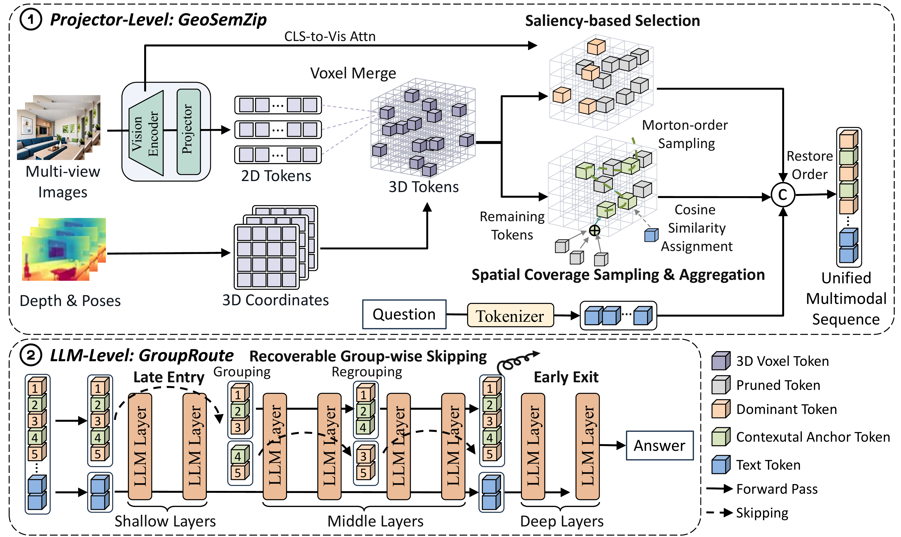

<h1 align="center">
  <span>GeoGR: Spatial–Semantic Token Compression and Group Routing for Efficient 3D VLMs</span><br>
</h1>


<div align="center">

[](https://github.com/EIT-NLP/GeoGR) [](https://huggingface.co/datasets/EIT-NLP/GeoRG-67K-CAT)

Yongxin Zheng<sup>1,*</sup>, Hao Wu<sup>1,2,*</sup>, Fang Li<sup>1</sup>, Hu Fu<sup>1</sup>, Peiran Yin<sup>1,2</sup>, Xudong Wang<sup>1</sup>,<br>
Haozhe Hu<sup>1,2</sup>, Xinghao Chen<sup>1,3</sup>, Yunpu Ma<sup>4</sup>, Wei Zhang<sup>1</sup>, Xiaoyu Shen<sup>1,†</sup>

<sup>1</sup>EIT-NLP Lab, Eastern Institute of Technology, Ningbo<br>
<sup>2</sup>Shanghai Jiao Tong University · <sup>3</sup>The Hong Kong Polytechnic University<br>
<sup>4</sup>Munich Center for Machine Learning, LMU Munich<br>
<sup>*</sup>Equal contribution · <sup>†</sup>Corresponding author

</div>

<p align="center">
  
</p>

This repository contains the implementation of **GeoGR**, a two-stage framework for efficient multi-view 3D vision-language models. **GeoSemZip** compresses cross-view visual tokens at the projector output; **GroupRoute** reduces their computation inside the language decoder while allowing skipped tokens to rejoin at later anchor layers. We provide integrations for **LLaVA-OneVision-7B** and **Video-3D LLM-7B**, together with post-training and evaluation scripts.

## Contents

- [Highlights](#highlights)
- [Results](#results)
- [Installation](#installation)
- [Data](#data)
- [Training](#training)
- [Evaluation](#evaluation)
- [Documentation](#documentation)
- [Citation](#citation)
- [License](#license)
- [Acknowledgments](#acknowledgments)

## Highlights

- **Spatial–semantic token compression.** GeoSemZip consolidates observations across views into 3D voxel tokens. Semantic saliency selects dominant tokens, Morton-order sampling preserves spatial coverage, and residual merging aggregates unselected features into contextual anchors.
- **Recoverable group routing.** GroupRoute combines late entry and early exit with query-conditioned group-wise skipping. Skipped tokens retain their hidden states and can resume computation after regrouping at later anchors.
- **Two complementary backbones.** GeoGR supports both LLaVA-OneVision, which uses geometry to guide compression, and Video-3D LLM, which also incorporates explicit 3D positional information.

## Results

The manuscript reports the following results relative to the dense post-trained models at approximately **10% retained LLM-side visual FLOPs**:

| Backbone | Performance retained | LLM prefill speedup | Time-to-first-token speedup | Active visual tokens per LLM layer |
| --- | ---: | ---: | ---: | ---: |
| LLaVA-OneVision-7B | 95.18% | 6.8× | 2.4× | 638 |
| Video-3D LLM-7B | 96.80% | 6.1× | 2.3× | 671 |

LLaVA-OneVision results cover **ScanQA and SQA3D**. Video-3D LLM results cover **ScanQA, SQA3D, Scan2Cap, ScanRefer, and Multi3DRefer**. Performance retention is the average relative to the dense baseline over the reported metrics; it is not an absolute accuracy score. Prefill speedup measures the LLM prefill phase; time to first token includes vision encoding and projector compression. These values are reported in the manuscript and may vary with hardware and runtime.

## Installation

Use **Linux, Bash, Python 3.10, and NVIDIA GPUs with CUDA support**. Both backends share one `geogr` environment. Training uses BF16 and DeepSpeed ZeRO-3; the example launchers use four GPUs with a global batch size of 16.

```bash
git clone https://github.com/EIT-NLP/GeoGR.git
cd GeoGR
conda create -n geogr python=3.10 -y
conda activate geogr
python -m pip install --upgrade pip
python -m pip install -e "./algorithm/LLaVA-NeXT[train]" \
  -e "./algorithm/Video-3D-LLM[train]" \
  -e "./lmms-eval[video]"
export ENV_NAME=geogr
```

Install FlashAttention separately for the default training attention implementation, using a build compatible with your PyTorch and CUDA versions. The backend training extras specify PyTorch `2.1.2`, torchvision `0.16.2`, NumPy `>=1.26.4,<2`, and Transformers `>=4.53,<4.54`.

Both backends expose a `llava` Python package. The maintained training and evaluation launchers select the appropriate source directory for each backend, so both use the same environment. Run the commands below from the GeoGR repository root. If the launchers cannot locate conda, set `CONDA_BASE=/absolute/path/to/miniconda3`.

## Data

Download the compression-aware post-training annotations from [**EIT-NLP/GeoRG-67K-CAT**](https://huggingface.co/datasets/EIT-NLP/GeoRG-67K-CAT/tree/main) and follow the dataset repository's instructions to extract them. The paper uses 66,940 PRISM-selected examples:

| Source | Original training pool | PRISM-selected examples |
| --- | ---: | ---: |
| ScanRefer | 36,665 | 11,000 |
| Multi3DRefer | 43,838 | 13,151 |
| Scan2Cap | 36,665 | 11,000 |
| ScanQA | 26,515 | 7,955 |
| SQA3D | 79,445 | 23,834 |
| **Total** | **223,128** | **66,940** |

Place the five training JSON files in `data/processed/subsets/` under this repository, matching the filenames in the [data preparation guide](docs/data_preparation.md). LLaVA-OneVision uses this layout by default. For Video-3D LLM, copy the training manifest, use absolute `json_path` entries, and set `DATA_YAML` as described in the guide. The launchers use the selected subsets directly.

Prepare the scene assets and benchmark data following the [bundled preprocessing instructions](algorithm/Video-3D-LLM/scripts/3d/preprocessing/README.md). Copy the evaluation path template below and fill in your local data paths:

```bash
cp lmms-eval/scannet3d_data_paths.example.yaml \
  lmms-eval/lmms_eval/tasks/_task_utils/scannet3d/data_paths.local.yaml
export THREE_D_CONFIG="$PWD/lmms-eval/lmms_eval/tasks/_task_utils/scannet3d/data_paths.local.yaml"
```

## Training

Compression-aware post-training has two stages. **Stage I adapts the projector and LLM to GeoSemZip; Stage II adapts the LLM to late entry and early exit. Group-wise skipping is enabled only during inference and requires no additional training.**

Run the commands from the repository root after preparing the data. Activate `geogr` and configure the local vision weights, coordinate cache, and GPUs:

```bash
export ENV_NAME=geogr
# Replace xxx with your actual SigLIP checkpoint path.
export SIGLIP_MODEL_PATH=xxx
export VISION_TOWER="$SIGLIP_MODEL_PATH"
export SCANNET3D_COORDS_CACHE_ROOT=/absolute/path/to/scannet3d-coords-cache
export GPU_IDS=0,1,2,3
export OFFLINE_MODE=1
```

For Video-3D LLM or a custom annotation location, set `DATA_YAML` to your training manifest and configure the scene roots as described in the [data preparation guide](docs/data_preparation.md#2-connect-the-selected-annotations).

### Stage I: GeoSemZip adaptation

Freeze the vision encoder and train the projector and full language model with projector compression enabled:

```bash
# Replace xxx with your actual checkpoint path.
MODEL_PATH=xxx \
OUTPUT_ROOT=/absolute/path/to/checkpoints/ov-stage1 \
  bash bash-paper/ov-train/train_geosemzip.sh
```

For Video-3D LLM, use the same environment, configure `IMAGE_FOLDER`, `VIDEO_FOLDER`, and `EMBODIEDSCAN_FOLDER` as described in the [data preparation guide](docs/data_preparation.md#3-prepare-scene-assets-and-held-out-annotations), and use:

```bash
# Replace xxx with your actual checkpoint path.
MODEL_PATH=xxx \
OUTPUT_ROOT=/absolute/path/to/checkpoints/video3d-stage1 \
  bash bash-paper/video-3d-train/train_geosemzip.sh
```

### Stage II: Late-entry/early-exit adaptation

Start from the Stage-I model, freeze the vision encoder and projector, and train the language model with the late-entry/early-exit window enabled. Despite its filename, `train_grouproute.sh` enables `late_entry_early_exit` during training; it does not enable `group_wise_skip_recovery`:

```bash
# Replace xxx with your actual Stage-I GeoSemZip checkpoint path.
MODEL_PATH=xxx \
OUTPUT_ROOT=/absolute/path/to/checkpoints/ov-stage2 \
  bash bash-llm/ov-train/train_grouproute.sh
```

For Video-3D LLM:

```bash
# Replace xxx with your actual Stage-I GeoSemZip checkpoint path.
MODEL_PATH=xxx \
OUTPUT_ROOT=/absolute/path/to/checkpoints/video3d-stage2 \
  bash bash-llm/video3d-train/train_grouproute.sh
```

Video-3D LLM also tunes its native 3D position embedding and grounding head by default. Both stages use one epoch, global batch size 16, learning rate `1e-5`, cosine decay, warm-up ratio `0.03`, and zero weight decay. Stage II requires a per-device batch size of 1; the launchers compute gradient accumulation to maintain the global batch size. See the [paper protocol](docs/paper_protocol.md) for the full configuration.

## Evaluation

Evaluate the complete GeoGR pipeline with a **Stage-II adapted checkpoint**:

```bash
# LLaVA-OneVision: ScanQA and SQA3D.
# Replace xxx with your actual Stage-II late-entry/early-exit checkpoint path.
MODEL_PATH=xxx \
  bash bash-llm/ILVAS/group-wise-skip-recovery/eval_geogr.sh

# Video-3D LLM: all five benchmarks; configure the Video3D data paths.
# Replace xxx with your actual Stage-II late-entry/early-exit checkpoint path.
MODEL_PATH=xxx \
  bash bash-llm/ILVAS/video3d/eval_geogr.sh
```

Run the command for your selected backbone in the `geogr` environment. Override `TASKS`, `GPU_IDS`, `OUTPUT_ROOT`, or `LIMIT` as needed; for a small evaluation run, use `LIMIT=1`. Evaluation uses batch size 1 and greedy decoding with at most 512 new tokens.

The maintained projector settings are `voxel_size=0.1`, `target_keep_ratio=0.30`, `dominant_ratio=0.85`, max attention reduction, and `grid_drop` serialization. GroupRoute uses one-based inclusive visual windows **[8,23]** for LLaVA-OneVision and **[8,24]** for Video-3D LLM, anchors **[9,13]**, and keep ratios **[0.5,0.5]**. Launcher exit boundaries are exclusive: `EARLY_EXIT_LAYER=24` and `25`, respectively.

For projector-only evaluation and comparison methods, see the [LLaVA-OneVision evaluation scripts](bash-paper/ov-eval/README.md) and [Video-3D LLM evaluation scripts](bash-paper/video-3d-eval/README.md).

## Documentation

| Guide | Contents |
| --- | --- |
| [Data preparation](docs/data_preparation.md) | Annotation placement, scene assets, and local paths |
| [Reproduction](docs/reproduction.md) | Environment variables, coordinate caches, and stage-by-stage commands |
| [Compression pipeline](docs/compression_pipeline.md) | GeoSemZip and GroupRoute implementation semantics |
| [Paper protocol](docs/paper_protocol.md) | Benchmark splits, compression settings, and optimization |
| [Repository layout](docs/repository_layout.md) | Model backends, evaluator, and launcher organization |

## Citation

If you find GeoGR useful, please cite the manuscript. This provisional entry will be updated with the public paper identifier when available.

```bibtex
@misc{zheng2026geogr,
  title  = {GeoGR: Spatial-Semantic Token Compression and Group Routing for Efficient 3D VLMs},
  author = {Zheng, Yongxin and Wu, Hao and Li, Fang and Fu, Hu and Yin, Peiran and Wang, Xudong and Hu, Haozhe and Chen, Xinghao and Ma, Yunpu and Zhang, Wei and Shen, Xiaoyu},
  year   = {2026},
  note   = {Manuscript},
  url    = {https://github.com/EIT-NLP/GeoGR}
}
```

## License

This source snapshot includes upstream code with its own license terms: [Video-3D LLM](algorithm/Video-3D-LLM/LICENSE) and [LMMs-Eval](lmms-eval/LICENSE). 

## Acknowledgments

We thank the authors and maintainers of [LLaVA-OneVision / LLaVA-NeXT](https://github.com/LLaVA-VL/LLaVA-NeXT), [Video-3D LLM](https://github.com/LaVi-Lab/Video-3D-LLM), [LMMs-Eval](https://github.com/EvolvingLMMs-Lab/lmms-eval), and [HiDrop](https://github.com/EIT-NLP/HiDrop), as well as the benchmark and compression-method authors whose work supports this project.
